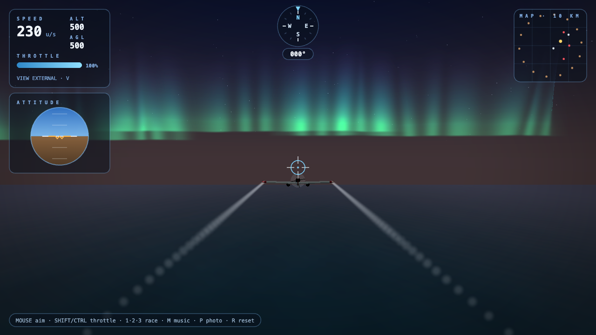

# SkyVector

Browser-based 3D flight simulator built with Three.js — procedural terrain, ring-race courses, a living world (bird flocks, balloons, AI traffic), aurora nights, a generative soundtrack, and a full glass-panel HUD. No build step, no assets, no framework: everything is procedural, in three plain script files. Serve the folder and fly.




<p align="center">
  
</p>

## Quick start

Browsers block loading `vendor/three.js` from `file://`. Use any static server:

```bash
git clone https://github.com/V3gaS/Sky_Vector_3d_Game.git
cd Sky_Vector_3d_Game
python3 -m http.server 8080
```

Open [http://localhost:8080](http://localhost:8080), then press **Space** or click the start prompt to fly.

Or with npm:

```bash
npm start
```

## Controls

| Input | Action |
| --- | --- |
| Mouse | Aim / bank toward cursor |
| W / S or ↑ / ↓ | Pitch assist |
| A / D or ← / → | Roll assist |
| Q / E | Yaw (rudder) |
| Shift | Increase throttle |
| Control | Decrease throttle |
| V | Toggle cockpit / external camera |
| R | Reset position / recover after crash |
| Space | Start from title screen |
| 1 / 2 / 3 | Start a race course (0 or Esc cancels) |
| M | Toggle music |
| P | Photo mode (hide HUD) |
| Gamepad | Left stick aim, triggers throttle, A reset, Y view |

## Features

### Racing
- Three ring-race courses: **Harbor Run** (easy), **City Slalom** (thread the skyscraper canyons), **Summit Climb** (high-altitude reversals)
- Glowing rings with light-pillar beacons, live timer, bearing chevron to the next ring
- Best times persist per course (localStorage); crash aborts the run

### Living world
- Bird flocks (boids) patrolling the coastline — they scatter if you buzz them
- Hot-air balloons drifting at altitude, burner-glow at night
- Two AI gliders on circuits with their own vapor trails
- Runway edge lighting, rotating airport beacon, tower strobes after dark

### Sky & atmosphere
- **Aurora borealis** curtains in the northern night sky, shooting stars, distant heat lightning, marsh fireflies
- Sky shader with horizon haze, sun disc + glow, stars and moon; golden hour with a low sun at dawn/dusk
- God rays, sun lens flare, bloom + vignette post-processing
- Water shader: multi-octave waves, fresnel sky reflection, sun glint
- Wingtip vapor trails, nav lights and tail strobe

### Generative soundtrack
- Procedural Web Audio score — warm lydian pads by day, sparse minor voicings at night, dusk shimmer
- Ducks to a low drone when you crash; **M** to mute

### Flight & HUD
- Arcade flight model with stall, throttle, and mouse aim
- **AGL** (height above terrain), speed, altitude, throttle, heading compass (top center), attitude indicator (left stack), mini-map
- Terrain, stall, obstacle, water, and crash warnings

### World & collision
- Procedural terrain with vertex colors (grass, rock, snow, shoreline)
- **Raycast ground placement** so buildings, towers, trees, runways, and mountains align with the rendered mesh
- Solid **buildings**, **towers**, **trees**, and **mountains**; tiered crashes (terrain, obstacles, water ditch)
- City on high ground, two runway strips, roads, instanced forests

### Graphics & atmosphere
- Sky shader with horizon haze, sun disc + glow, **stars and moon at night**, golden hour at sunrise and sunset
- Water shader: multi-octave waves, fresnel sky reflection, sun glint and sparkle
- Smooth-blended terrain biomes (beach, meadow, alpine, rock, snow) with valley shading
- Soft billboard clouds, ridged snow-capped mountains, sun lens flare
- **Wingtip vapor trails**, nav lights and tail strobe, propeller blur disk
- City buildings with **windows that light up at night**
- Post-processing: bloom, vignette, exposure/saturation; camera-follow shadows; speed-reactive FOV
- Glass-panel HUD and a redesigned title screen

### Audio
- Engine and wind (Web Audio), stall beep, scrape, splash, and crash sounds (starts after you begin flying)

## Project layout

| Path | Purpose |
| --- | --- |
| `index.html` | Game entry: flight model, collision, HUD, input, module host |
| `js/world-graphics.js` | Terrain, water, sky, clouds, post-FX, shared rendering helpers |
| `js/challenges.js` | Ring-race courses, timing, best times |
| `js/ambient.js` | Birds, balloons, AI traffic, airfield night lighting |
| `js/skyfx.js` | Aurora, shooting stars, heat lightning, fireflies |
| `js/soundtrack.js` | Generative Web Audio score |
| `vendor/three.js` | Bundled Three.js runtime (r150 classic build) |
| `docs/assets/screenshot.png` | README hero image |
| `docs/assets/gameplay.gif` | Animated demo |

## Regenerating the gameplay GIF

Requires [ffmpeg](https://ffmpeg.org/) and Chromium via Playwright:

```bash
npm install
npx playwright install chromium
npm run capture-demo
```

## Third-party licenses

- [Three.js](https://threejs.org/) — MIT ([vendor/three.js](vendor/three.js))

## License

This project is licensed under the [MIT License](LICENSE).
