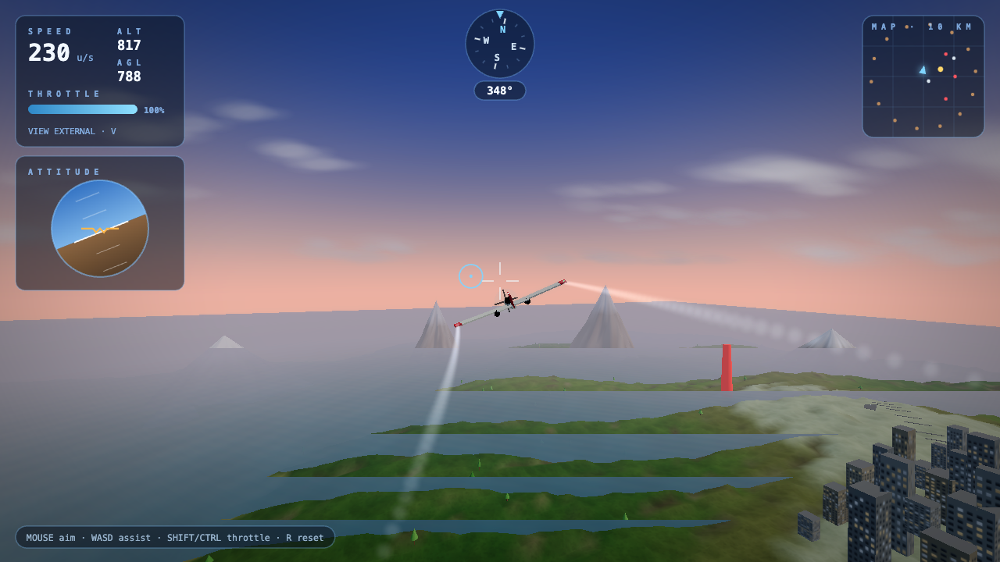

# SkyVector

Browser-based 3D flight simulator built with Three.js — procedural terrain, collision, arcade flight controls, and a full HUD. No build step: serve the folder and fly.



<p align="center">
  
</p>

## Quick start

Browsers block loading `vendor/three.js` from `file://`. Use any static server:

```bash
git clone https://github.com/V3gaS/Sky_Vector_3d_Game.git
cd Sky_Vector_3d_Game
python3 -m http.server 8080
```

Open [http://localhost:8080](http://localhost:8080), then press **Space** or click the start prompt to fly.

Or with npm:

```bash
npm start
```

## Controls

| Input | Action |
| --- | --- |
| Mouse | Aim / bank toward cursor |
| W / S or ↑ / ↓ | Pitch assist |
| A / D or ← / → | Roll assist |
| Q / E | Yaw (rudder) |
| Shift | Increase throttle |
| Control | Decrease throttle |
| V | Toggle cockpit / external camera |
| R | Reset position / recover after crash |
| Space | Start from title screen |

## Features

### Flight & HUD
- Arcade flight model with stall, throttle, and mouse aim
- **AGL** (height above terrain), speed, altitude, throttle, heading compass (top center), attitude indicator (left stack), mini-map
- Terrain, stall, obstacle, water, and crash warnings

### World & collision
- Procedural terrain with vertex colors (grass, rock, snow, shoreline)
- **Raycast ground placement** so buildings, towers, trees, runways, and mountains align with the rendered mesh
- Solid **buildings**, **towers**, **trees**, and **mountains**; tiered crashes (terrain, obstacles, water ditch)
- City on high ground, two runway strips, roads, instanced forests

### Graphics & atmosphere
- Sky shader with horizon haze, sun disc + glow, **stars and moon at night**, golden hour at sunrise and sunset
- Water shader: multi-octave waves, fresnel sky reflection, sun glint and sparkle
- Smooth-blended terrain biomes (beach, meadow, alpine, rock, snow) with valley shading
- Soft billboard clouds, ridged snow-capped mountains, sun lens flare
- **Wingtip vapor trails**, nav lights and tail strobe, propeller blur disk
- City buildings with **windows that light up at night**
- Post-processing: bloom, vignette, exposure/saturation; camera-follow shadows; speed-reactive FOV
- Glass-panel HUD and a redesigned title screen

### Audio
- Engine and wind (Web Audio), stall beep, scrape, splash, and crash sounds (starts after you begin flying)

## Project layout

| Path | Purpose |
| --- | --- |
| `index.html` | Game entry (markup, HUD, flight logic) |
| `js/world-graphics.js` | Terrain, water, sky, ground sampling, post-FX, trees |
| `vendor/three.js` | Bundled Three.js runtime |
| `docs/assets/screenshot.png` | README hero image |
| `docs/assets/gameplay.gif` | Optional animated demo |

## Regenerating the gameplay GIF

Requires [ffmpeg](https://ffmpeg.org/) and Chromium via Playwright:

```bash
npm install
npx playwright install chromium
npm run capture-demo
```

## Third-party licenses

- [Three.js](https://threejs.org/) — MIT ([vendor/three.js](vendor/three.js))

## License

This project is licensed under the [MIT License](LICENSE).
