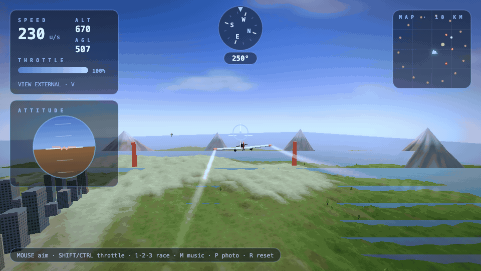

# SkyVector

Browser-based 3D flight simulator — procedural terrain, clouds, and an arcade flight model. No build step: open the page from any static file server.



## Quick start

You need a local web server (browsers block `file://` loading of the Three.js script).

```bash
git clone https://github.com/V3gaS/Sky_Vector_3d_Game.git
cd Sky_Vector_3d_Game
python3 -m http.server 8080
```

Open [http://localhost:8080](http://localhost:8080), then press **Space** or click the start prompt to fly.

Or with npm:

```bash
npm start
```

## Controls

| Input | Action |
| --- | --- |
| Mouse | Aim / bank toward cursor |
| W / S or ↑ / ↓ | Pitch assist |
| A / D or ← / → | Roll assist |
| Q / E | Yaw (rudder) |
| Shift | Increase throttle |
| Control | Decrease throttle |
| V | Toggle cockpit / external camera |
| R | Reset position |
| Space | Start from title screen |

## Project layout

| Path | Purpose |
| --- | --- |
| `index.html` | Game entry point (markup, styles, logic) |
| `vendor/three.js` | Bundled Three.js runtime (r150+) |
| `docs/assets/gameplay.gif` | README demo capture |

## Regenerating the README GIF

Requires [ffmpeg](https://ffmpeg.org/) and Chromium via Playwright:

```bash
npm install
npx playwright install chromium
npm run capture-demo
```

## Third-party licenses

- [Three.js](https://threejs.org/) — MIT ([vendor/three.js](vendor/three.js))

## License

This project is licensed under the [MIT License](LICENSE).
